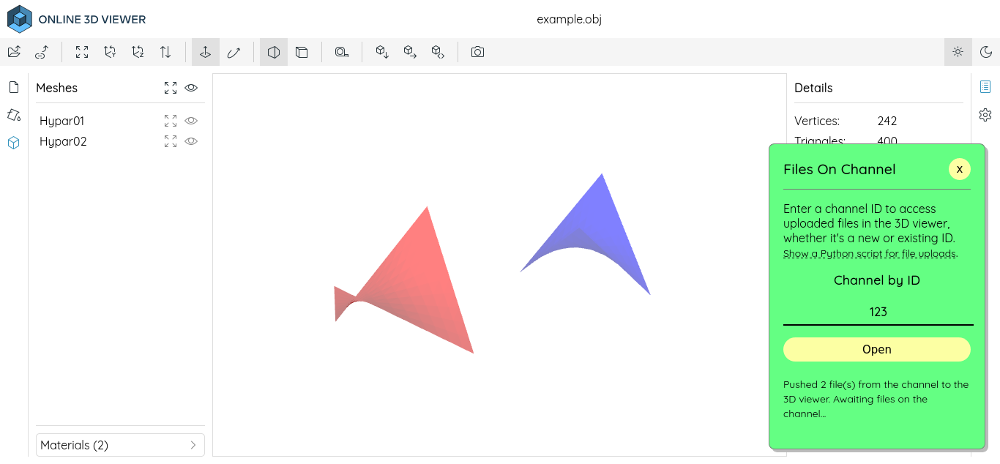

# 3D Viewer for Topologicpy

This project is written in [Deno](https://deno.com) to provide a web server for
the Online3DViewer with integration capabilities for Topologicpy.



## Getting Started

To run the web server, use `run.bat` or `run.sh` depending on your operating
system.

You can deploy this project on [Deno Deploy](https://deno.com/deploy/pricing),
which offers a free plan. Run `deploy.bat` or `deploy.sh` to start deployment
under your account and on your domain name (install `deployctl` in advance).

## Python Examples

In the `examples` directory, you'll find `upload.py`, a script that uploads
`torus.mtl` and `torus.obj` samples to the 3D viewer channel identified by
`123`. Use the following HTTP POST URL to upload:
<http://127.0.0.1:8000/upload/123>.

After uploading, you can view the models at:
<http://127.0.0.1:8000/#channel=123>.

Subsequent uploads to channel `123` will automatically update in your browser
unless closed. For better security, create unique channel IDs.

## Notices

This project uses Online3DViewer, licensed under the [MIT
License](https://opensource.org/licenses/MIT):

```
MIT License

Copyright (c) 2023 Viktor Kovacs

Permission is hereby granted, free of charge, to any person obtaining a copy
of this software and associated documentation files (the "Software"), to deal
in the Software without restriction, including without limitation the rights
to use, copy, modify, merge, publish, distribute, sublicense, and/or sell
copies of the Software, and to permit persons to whom the Software is
furnished to do so, subject to the following conditions:

The above copyright notice and this permission notice shall be included in all
copies or substantial portions of the Software.

THE SOFTWARE IS PROVIDED "AS IS", WITHOUT WARRANTY OF ANY KIND, EXPRESS OR
IMPLIED, INCLUDING BUT NOT LIMITED TO THE WARRANTIES OF MERCHANTABILITY,
FITNESS FOR A PARTICULAR PURPOSE AND NONINFRINGEMENT. IN NO EVENT SHALL THE
AUTHORS OR COPYRIGHT HOLDERS BE LIABLE FOR ANY CLAIM, DAMAGES OR OTHER
LIABILITY, WHETHER IN AN ACTION OF CONTRACT, TORT OR OTHERWISE, ARISING FROM,
OUT OF OR IN CONNECTION WITH THE SOFTWARE OR THE USE OR OTHER DEALINGS IN THE
SOFTWARE.

```

Thanks to the creators of Online3DViewer.
