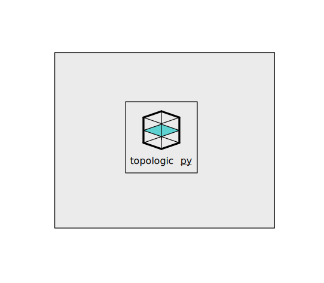

# topologicpy

**topologicpy** is a FOSS python 3 implementation of [Topologic](https://topologic.app).

[**Topologic**](https://topologic.app/) is a software modeling library enabling hierarchical and topological representations of architectural spaces, buildings and artefacts through non-manifold topology. 

[**Sverchok**](http://nortikin.github.io/sverchok/) is a powerful Blender Addon parametric tool for architects, allowing geometry to be programmed visually with nodes. 

## Installation
**topologicpy** can be install using the **pip** command as such:

`pip install topologicpy --upgrade`

## Prerequisites

topologicpy depends on the following python libraries which will be installed automatically from pip:

<b>Expand to view dependencies</b>

* [numpy](http://numpy.org) >= 1.24.0
* [scipy](http://scipy.org) >= 1.10.0
* [plotly](http://plotly.com/) >= 5.11.0
* [ifcopenshell](http://ifcopenshell.org/) >=0.7.9
* [ipfshttpclient](https://pypi.org/project/ipfshttpclient/) >= 0.7.0
* [web3](https://web3py.readthedocs.io/en/stable/) >=5.30.0
* [openstudio](https://openstudio.net/) >= 3.4.0
* [lbt-ladybug](https://pypi.org/project/lbt-ladybug/) >= 0.25.161
* [lbt-honeybee](https://pypi.org/project/lbt-honeybee/) >= 0.6.12
* [honeybee-energy](https://pypi.org/project/honeybee-energy/) >= 1.91.49
* [json](https://docs.python.org/3/library/json.html) >= 2.0.9
* [py2neo](https://py2neo.org/) >= 2021.2.3
* [pyvisgraph](https://github.com/TaipanRex/pyvisgraph) >= 0.2.1
* [specklepy](https://github.com/specklesystems/specklepy) >= 2.7.6
* [pandas](https://pandas.pydata.org/) >= 1.4.2
* [scipy](https://scipy.org/) >= 1.8.1
* [dgl](https://github.com/dmlc/dgl) >= 0.8.2

### Binaries

Download the latest Release binaries from the Releases link found on the right side of this [page](https://github.com/wassimj/topologicpy/releases).

## Installation

1. After you download the ZIP file, extract the topologicpy folder.
1. Place the topologicpy folder at a location that your python system can find.

## How to use
1. Open your favourite python editor
1. Type 'import topologicpy'
1. Start using the API

## API Documentation
API documentation can be found at [https://topologic.app/topologicpy_doc/topologic_pdoc/](https://topologic.app/topologicpy_doc/topologic_pdoc/)
